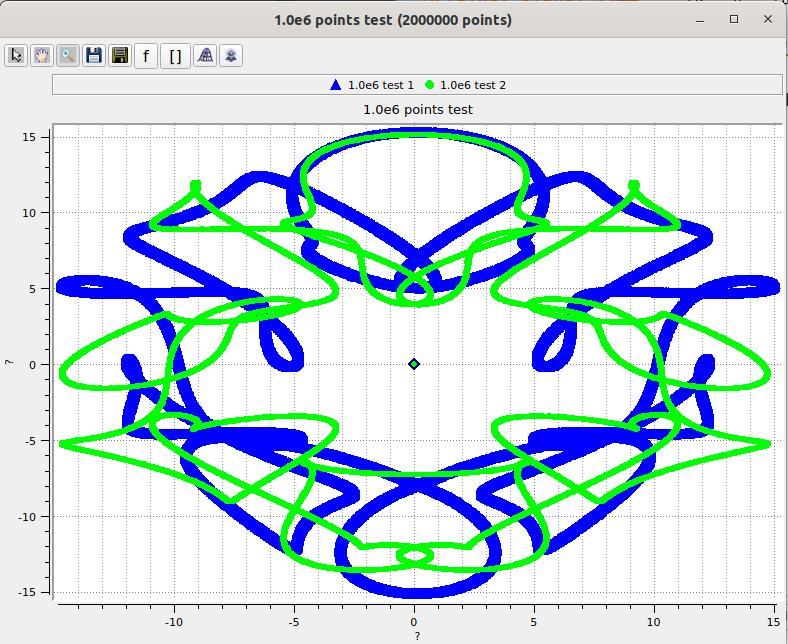
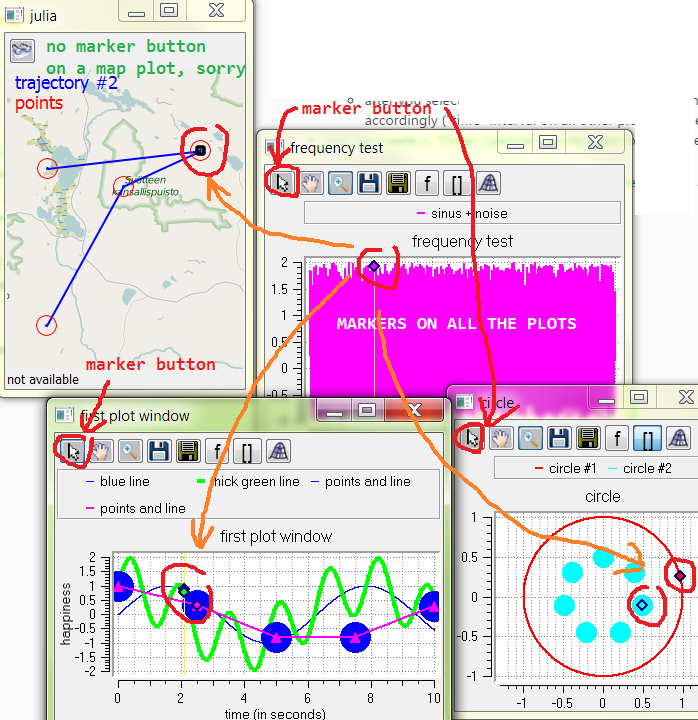
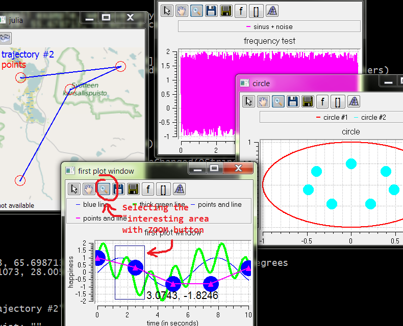
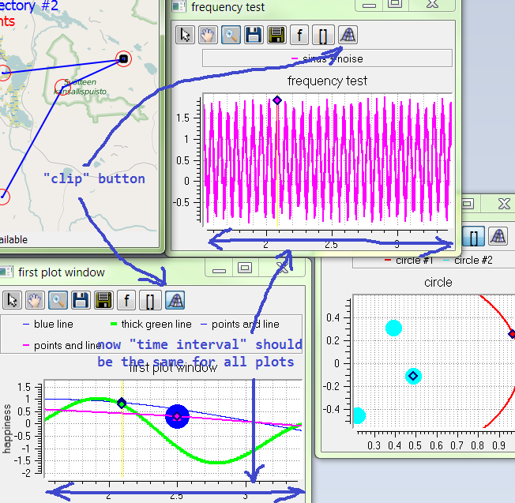
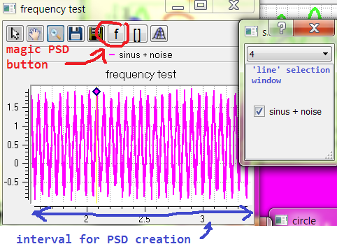
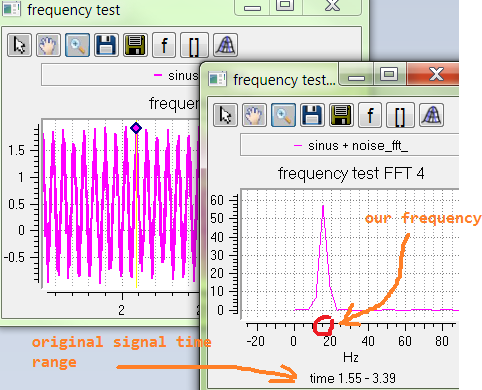
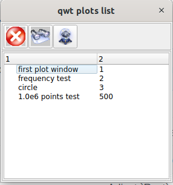
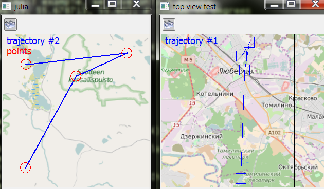
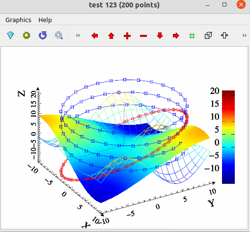
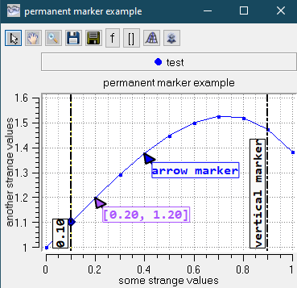

# QWTWPlot
This is another 2D plotting tool for Julia language.  It is based on `qwtw` `C` library, which is based on `QWT` library which is based on `QT` library. Also, `MathGL` and `KDE Marble` libraries are used.

quickly draw a lot of points:
 

Current version supposed to work for `Windows` _and_ for `Linux` x64 bits.
It is very useful for data analysis (like if you have a dynamic systems with a big state vector, sometimes its difficult to say how one variable influence other variable).

## how to install it

* just install it as usual Julia package, with `] add QWTWPlot` .  

BTW, this is possible because of https://github.com/JuliaPackaging/BinaryBuilder.jl

look at usage example here: https://github.com/ig-or/QWTWPlot.jl/blob/master/src/qwexample.jl

## the most useful features

* all plots are "connected" - this makes it very easy to analyze small parts of long dynamic process with a lot of variables;  what this means:

  * when you point a 'marker' on one plot, you can see markers on all other plots pointing on the 'same place'

how "markers" looks like:

 

  * after you select some interesting area on plot "X", and then press right plot button ("CLIP" button),  all the other plots are resizing accordingly ("time" interval on all other plots became equal to this interval on plot "X")

First, select some interesting area on one plot:

 

After this, press "clip" button:

 

* you can create a "Power Spectral Dencity" plot for some  (selected) area of your plot, by pressing "f" button

First, select a desired time range with ZOOM tool and then press "f" button:

After this (in new small window) select lines for which you'd like to create a PSD plots, select "window size" (not very big) and close this small window (Alt+F4?).  Enjoy new PSD plot! You can easily estimate the frequency of the original signal. Again, PSD was created only from the data which were visible on the 'original' plot.

* you can draw a 'meta-window' with list of all plots; This is very convenient in case you have 10 - 15 plots or even more

* this library have UDP client&server, so it can display incoming "marker" messages and send out marker positions when using "marker gui"

 * Maps functionality returned. You can draw on maps. Please see example for the details.
 
 

 * Now its possible to create 3D lines and surfaces (because of MathGL).  There are a few details about how to do this in the example.    https://github.com/ig-or/QWTWPlot.jl/blob/master/src/qwexample.jl
 
 Markers not supported here (yet?).
 

 also,  it's possible to remove or change existing lines on plots (see an example how to do it)(implemented for simple 2D plots).

 ### keyboard shortcuts
 * _M_ switch to "marker mode"
 * _P_ switch to "pan mode"
 * _Z_ switch to "zoom mode"
 * _V_ add/remove "(permanent)vertical marker" to the current marker position
 * _Shift+V_  same as _V_ but for all the existing plots which can support it (simple 2D plots)
 * _A_  add/remove an "(permanent) arrow-like marker" to the current marker position.

 For permanent vertical markers, you can change its label, and for "arrow" marker you can change its label and color.
 How those (permanent) markers looks like:
 

 I suspect the underlying qwtw library is not thread-safe, so would not recommend to use it from different julia threads simultaneously. 
 
