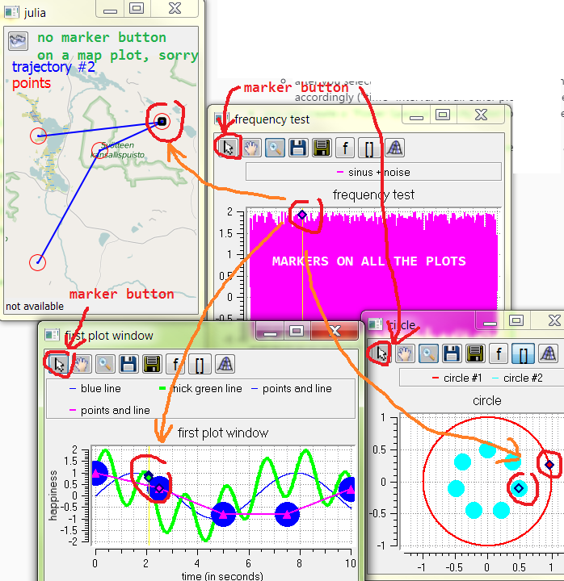
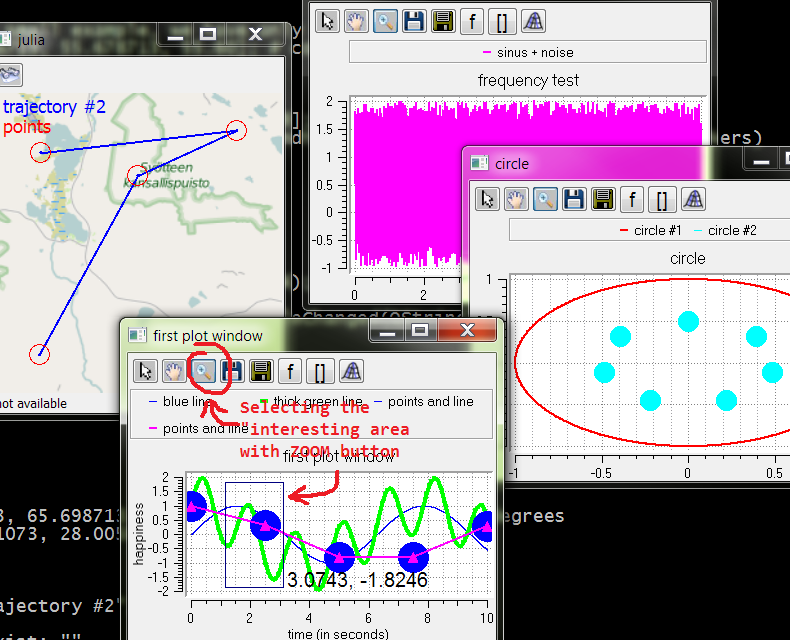
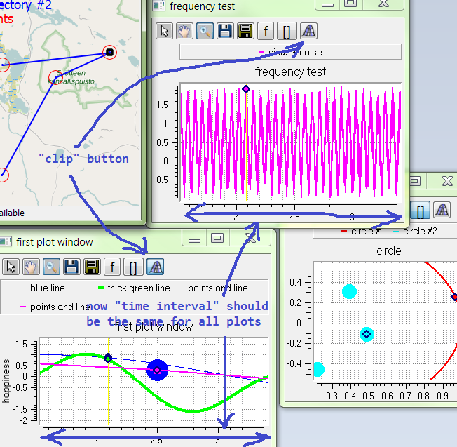

### the most useful features are following:

* you can draw lines and points on Earth map

a couple of map examples:

 

* all plots are "connected" - this makes it very easy to analyze small parts of long dynamic process with a lot of variables;  what this means - see below

* when you point a 'marker' on one plot, you can see markers on all other plots pointing on the 'same place'

how "markers" looks like:

 

* after you select some interesting area on plot "X", and then  press right plot button ("CLIP" button),  all the other plots are resizing accordingly ("time" interval on all other plots became equal to this interval on plot "X")

First, select some interesting area on one plot:

 

After this, press "clip" button:

 

* you can create a "Power Spectral Dencity" plot for some  (selected) area of your plot, by pressing "f" button

First, select a desired time range with ZOOM tool and then press "f" button:

After this (in new small window) select lines for which you'd like to create a PSD plots, select "window size" (not very big) and close this small window (Alt+F4?).  Enjoy new PSD plot! You can easily estimate the frequency of the original signal. Again, PSD was created only from the data which were visible on the 'original' plot.

* you can draw a 'meta-window' with list of all plots; This is very convenient in case you have 10 - 15 plots or even more

At the very beginning I tried to make some tool with very simple and mathlab-like interface. But after some time, new features were added.
 